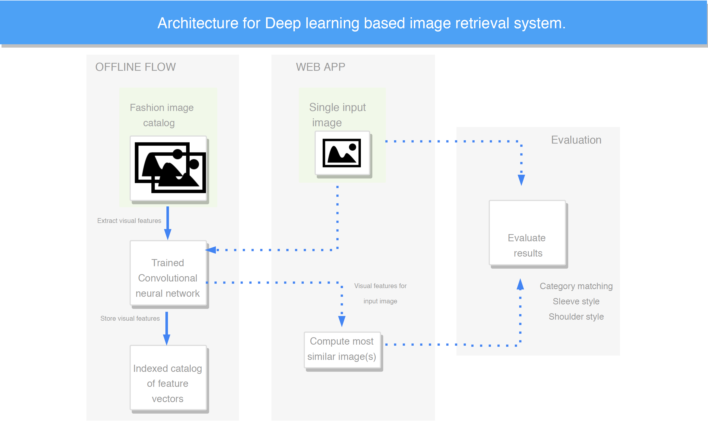

# Springboard Final Project Architecture

>Proposed clothing item search engine using deep learning.



> Overview
- This is a simple image-based image search engine using Keras + Flask. The architecture involves using a CNN to generate image embeddings which were used to measure similarity between images. Running this demo requires running a jupyter script to reorganize the dataset using sumbolic links. Be sure to save images to dataset directory in the same format as [the original data source](https://drive.google.com/drive/folders/0B7EVK8r0v71pQ2FuZ0k0QnhBQnc)  
- `vgg_keras.ipynb`: This script creates symbolic links that fetches only required images of upper body  wears from the deep fashion dataset. For each image it uses the VGG16 network with ImageNet pre-trained weights to create a catalog of feature vectors, saves as `hamming_train_vectors.pickle`.
- `app.py`: Contains a flask based server which launches a user interface and provides input sources for querying an image. The top matches are retrieved using a simple hamming distance comparison.

## Usage
```bash
# Clone source code locally
$ git clone https://github.com/Davodu/sb.git
$ cd sb
$ pip install -r requirements.txt

#Download deep fashion dataset to dataset/ directory
# Move the contents of Img to static/

run the jupyter file >models_jupyter/vgg_keras.ipynb to reorganize dataset.
# Vgg generated feature vectors will be saved to dataset/modified_new/

$ python app.py
# Now you can do the search via localhost:8787
```

Demo picture:


